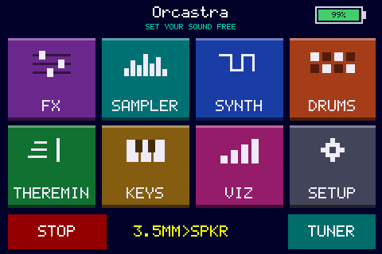
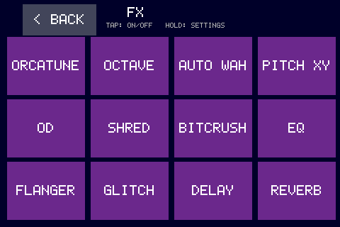
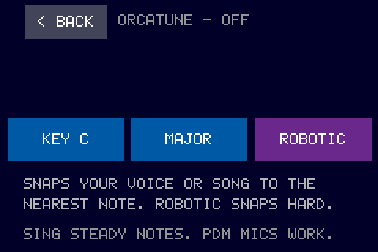
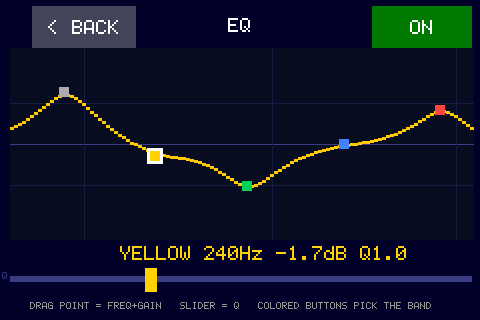
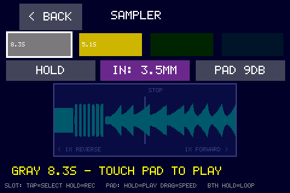
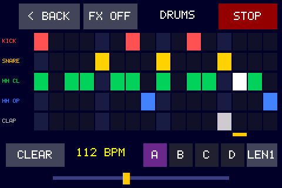
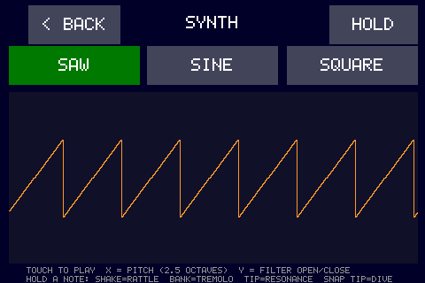
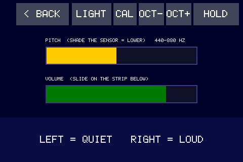
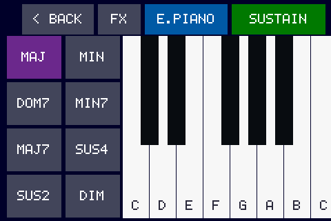
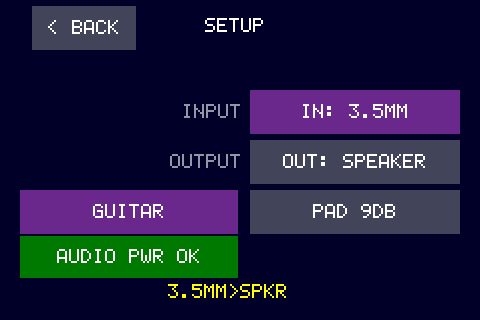

# Orcastra

A real-time audio multi-tool for the **[FREE-WILi 2][fw2]** — twelve effects, a
five-slot sampler, a drum machine, a synth, a light-controlled theremin, a
chord keyboard and a tuner, all running on the display processor's second core
and driven entirely from the touchscreen.

It is built against **one dependency**: [wilibsp][wilibsp], the FREE-WILi 2
board support package. No vendored drivers, no private headers. Everything here
is reachable from a stock FREE-WILi 2 and a `git clone --recursive`.



It launches from the device's own `/apps` menu like any other FREE-WILi 2 app —
it does not replace your display firmware — and it executes **from PSRAM**,
which is what keeps 112 KB of SRAM free for the audio path.

[fw2]: https://freewili.com
[wilibsp]: https://github.com/freewili/wilibsp

### See it played

[](https://www.youtube.com/watch?v=Nq65TJWKn_0)

*Demoing Orcastra at the Punk Rock Museum in Las Vegas.* ▶ [Watch on
YouTube](https://www.youtube.com/watch?v=Nq65TJWKn_0)

---

## Try it without building anything

1. Grab [`prebuilt/orcastra.uf2`](prebuilt/orcastra.uf2).
2. Mount your FREE-WILi 2's SD card and drop it in `/apps`.
3. Unmount, then pick **orcastra** from the on-device apps menu.

That's the whole install. The app is ~425 KB and stages itself into PSRAM at
`0x11000000`; your display firmware is untouched, and a power cycle puts you
back in the launcher.

> **Start at `PAD 24DB` before you put headphones on, then bring it up.** The
> onboard speaker is deliberately volume-limited (see
> [Sound safety](#sound-safety)); the 3.5 mm jack is **not** — it runs
> full-scale, which is right for an amp or an audio interface and *loud* into
> headphones.
>
> Bench check with in-ear monitors: they work fine, and they get loud.
> `PAD 12DB` was plenty for comfortable listening, so there is no reason to go
> anywhere near the top of the range on headphones.

---

## What's in it

### Effects — twelve, chainable, with a settings page each



Tap a tile to toggle the effect; **hold** it to open that effect's parameter
page. The chain runs in a fixed order so the results stay predictable.

Four more are written, tested and *dormant* — TREMOLO, PHASER, RINGMOD and
VOWEL — each behind an `FX_ENABLE_*` define in `apps/orcastra/fx.h`, with a
note there on why it lost its grid slot. Flipping one back on is a one-line
change and a good way to find your way around.

| | | |
|---|---|---|
| **Orcatune** — real-time vocal pitch correction (autocorrelation pitch detection + PSOLA resynthesis), key/scale aware, natural or robotic | **Octave** — up/down octave and detune modes | **Auto Wah** — envelope-following band-pass |
| **Pitch XY** — a full-screen pad, ±1.5 octaves on X, wet amount on Y, and the position *sticks* when you let go | **OD** — soft-clip overdrive | **Shred** — hard-clip, mid-focused |
| **Bitcrush** — bit-depth and sample-rate reduction | **EQ** — five-band parametric with a live response plot | **Flanger** — short modulated delay with feedback, classic analog BBD-style |
| **Glitch** — buffer stutter / repeat | **Delay** — tempo-ish delay with feedback | **Reverb** — eight-comb, four-allpass tank |



Orcatune is the deepest of them: it detects pitch by autocorrelation and
resynthesises with PSOLA, so it snaps to the nearest note *in the key and scale
you pick* rather than to the nearest semitone. Robotic mode holds the snap hard;
natural mode glides into it.



The EQ page is worth calling out: drag any of the five band handles to set
frequency and gain at once, set Q on the strip underneath, and pick the active
band with the coloured hardware buttons or the D-pad. The five bands are named
for the five coloured buttons, so what the readout says is what you press.

### Sampler — five slots, live speed control



Tap a slot to select it, hold to record. Drag on the waveform pad to scrub
playback rate continuously from 1× reverse, through stop, to 1× forward — it
tracks your finger, so it behaves like a turntable rather than a speed knob.

**HOLD** latches the loop hands-free, and that is the interesting part: the loop
keeps running while you back out to the FX menu and build a chain on top of it,
so the sampler becomes a source for everything else in the app rather than a
page you visit.

Two slots ship pre-seeded so there is something to play with on first launch —
a dial-up modem handshake and a synthesised singing voice, both generated rather
than sampled.

### Drums — 16 steps, four banks, chainable



Five voices, all synthesised. Tap cells to program, chain banks A–D into a
longer pattern, and set tempo on the strip at the bottom. The playhead chases
in real time and the sounding cells flash.

### Synth — XY pad with motion control



Saw, sine or square. X is pitch across 2.5 octaves, Y opens and closes the
filter. With a note held, the onboard IMU takes over as a modulation source:
shake for rattle, bank for tremolo, tip for resonance, snap-tip to dive.

### Theremin — played with light



The ambient light sensor sets pitch — shade it to go lower — and a touch strip
sets volume. There's a magnetometer mode too, if you'd rather wave a magnet
around than your hand.

### Keys — chord keyboard



An octave of keys plus eight chord qualities, with sustain. Each key strikes a 4-voice polyphonic chord — enough for the widest 7th — in one of two
instruments: a 2-operator FM electric piano, or detuned PolyBLEP saw
strings.

### Tuner and visualiser

A needle tuner with LED guidance for when the display is facing away, and a
spectrum/scope visualiser reachable from any page with the PAGE button.

---

## Setup page



Pick your input (3.5 mm, onboard PDM mics, or a gain-staged guitar/line/mic
profile) and output (speaker or jack), and set the output pad. The status line
shows the live route and whether the audio codec's power rail actually came up.

---

## Sound safety

The onboard speaker is an 8 Ω micro-speaker rated **300 mW continuous /
500 mW absolute maximum** — *not* the 2 W that some early documentation
claimed. A full-scale sine at 0 dB delivers roughly 0.7–1.1 W into it, which is
2–3× the absolute maximum. We know because that is how the first bench speaker
died.

So this app will not let you do that. Two guards, and **you should keep both if
you fork this**:

1. **Speaker output is capped at −9 dB** (88–139 mW worst case, 29–46% of the
   continuous rating). The derate is against the *continuous* number rather
   than the peak, because this app really does sustain full-scale tones
   indefinitely — the theremin, the test tone, and the synth with HOLD on. The
   3.5 mm jack path is unrestricted.
2. **A 2nd-order 900 Hz high-pass on the speaker route.** The driver's
   passband floor is around 1.7 kHz; content below its self-resonance is raw
   cone excursion, which damages the driver *and* sounds broken regardless of
   level.

Both live in `apps/orcastra/main.c` — search for `VOL_ORDER` and
`vol_loud_ok()`.

---

## Building it

You need the Raspberry Pi Pico SDK toolchain (the VS Code Raspberry Pi Pico
extension installs a self-contained one under `~/.pico-sdk`, which is what the
build driver looks for).

```bash
git clone --recursive https://github.com/gtasseff/orcastra.git
```

```bash
cd orcastra && python tools/fw.py build
```

That configures and builds, and the artifact you want is
`build/apps/orcastra/orcastra.uf2`. Copy it to `/apps` on the SD card as above.

If you already cloned without `--recursive`:

```bash
git submodule update --init --recursive
```

### The two build targets

| target | where it runs | use it for |
|---|---|---|
| `orcastra_psram` → **`orcastra.uf2`** | executes in place from PSRAM | the real thing; the only variant with SRAM to spare |
| `orcastra_sd` | staged in PSRAM, copied to SRAM to run | comparison / fallback |

Both load at `0x11000000`, so **nothing here can be programmed into the
device's flash**, by design — that address range holds the stock display
firmware, which is the bootloader that launches apps from the card. Apps are
delivered by copying the `.uf2` to `/apps`. There is no `fw flash`.

The PSRAM-resident target is the interesting one and it is not free — see
[`AGENTS.md`](AGENTS.md) for why the boot re-clock has to happen from SRAM and
what happens if it doesn't. `python tools/check_psram_xip.py` asserts the whole
scheme structurally after any change to the linker scripts.

### Optional: the screenshot / input harness

```bash
cmake -B build -DFW2_AGENTIO=ON && python tools/fw.py build
```

Every screenshot in this README was taken that way, over SWD, from the running
device:

```bash
python tools/agentio.py screenshot -o shot.png
```

`touch x y`, `press`, `hold`, `release` and `type` work too. Note the harness
costs ~45 KB of SRAM under `copy_to_ram`, so `orcastra_sd` is skipped when it's
enabled, on purpose. On the PSRAM-resident target its code lands in PSRAM and
the real cost is about 7 KB of SRAM, which is why that target is the only one
with room for it.

---

## Using this as a starting point

That's what it's for. The audio engine is deliberately boring to extend:
everything is a block-based `process(in, out, n)` function on 16-bit mono at
48,828 Hz, and the whole chain is assembled in one readable place.

**Start here:** [`docs/ADDING-AN-EFFECT.md`](docs/ADDING-AN-EFFECT.md) walks
through adding one end to end — DSP, a menu tile, a parameter page and touch
handling — by following what an existing effect already does.

**Then read** [`AGENTS.md`](AGENTS.md). It is the accumulated
this-cost-us-an-afternoon list for this hardware: the capture deadline, why
full-screen redraws tear the microphone ring, the PSRAM timing that has to be
set before the clock changes, how the power coprocessor wants to be asked for
the audio rail, and which reset gesture recovers a wedged unit. Most of it was
learned the expensive way. It is written for a coding agent but it reads fine
for a human, and it will save you real time.

### The map

```
apps/orcastra/
  main.c        UI, pages, touch/button handling, the audio pump      (the bulk)
  fx.c/.h       the twelve effects, the chain, EQ, pitch correction
  vox.c/.h      five-slot sampler in PSRAM
  synth.c/.h    the XY synth voice
  drums.c/.h    drum voices + the step sequencer
  keys.c/.h     chord keyboard
  viz.c/.h      spectrum / scope visualiser
  voice_data.c  the synthesised voice, generated (see LICENSE for provenance)
  sd_entry.c    launched-from-SD entry: IRQ handover, PSRAM re-time, clocks
  psram_xip_link/   linker overrides that keep the timing-critical set in SRAM
tools/
  fw.py         build / flash / RTT log driver
  agentio.py    screenshot + input injection over SWD
  check_psram_xip.py   structural verification of the PSRAM-execution build
  read_boot_stage.py   read the boot breadcrumb from a hung app, without halting
```

---

## Hardware notes

Built and tested on a production FREE-WILi 2 (RP2350B display processor, 8 MB
PSRAM, NAU88C10 codec). The audio path is 16-bit mono at 48,828 Hz with a
5.2 ms capture deadline — see `AGENTS.md` for what that constrains.

The FREE-WILi 2 is a handheld hardware-hacking and embedded-development tool; if
you don't have one, it lives at <https://freewili.com>. Everything here runs on
a stock unit — no modifications, no added hardware, and it does not replace the
firmware that shipped on it.

Getting audio in *and* out of the single 3.5 mm TRRS jack needs the right
adapter, which is not obvious and is easy to get wrong — a buying guide is on
the [roadmap](#roadmap--not-done-yet).

A breakout wiring diagram for line-level input exists but is **deliberately not
published yet**: adding a headphone jack to it disturbed the impedance and the
unit stopped working with headphones plugged in. Publishing it as-is would just
have people building the same fault. It goes up once it is fixed and retested.

---

## Roadmap / not done yet

Kept honest on purpose — these are known gaps, not vague ambitions.

### Getting audio in and out

- **TRRS adapter buying guide.** One 3.5 mm TRRS jack carries both input and
  output, so routing audio in *and* out at once needs a specific splitter — and
  the wrong one silently gives you no input, or no output, with no error to tell
  you which. A parts list with links is the single most useful thing missing
  from this README.
- **The orca-shaped breakout box.** A 3D-printed orca that sits at the end of a
  plain TRRS-to-TRRS cable and breaks the single jack out into a separate input
  and output. The point is that the cable is the only thing touching the device
  — all the adapters and wiring live in the orca instead of dangling off the
  FREE-WILi 2 in a tangle. STEP files to publish so anyone can print one.
- **The breakout's wiring diagram.** Withheld until fixed. Adding a headphone
  jack to the breakout disturbed the impedance and the unit stopped working with
  headphones plugged in, so publishing it as-is would just reproduce the fault
  in other people's builds. Needs a rework and a retest first.

### Audio

- **Arpeggiator.** Specced, not built. It is the feature that ran the
  copy_to_ram build out of SRAM in the first place, and a large part of why the
  app now executes from PSRAM — so the room for it exists now.
- **The four dormant effects** (TREMOLO, PHASER, RINGMOD, VOWEL) are written and
  disabled behind `FX_ENABLE_*` in `fx.h`, each with a note on why it lost its
  grid slot. Twelve tiles fill a 4×3 grid with no empty cell, so bringing one
  back means retiring another.
- **An RMS-tracking limiter on the speaker route.** This is the honest way to
  raise the speaker ceiling past −9 dB: the current cap has to assume a
  sustained full-scale sine, because nothing stops you playing one. A limiter
  that tracks real programme material could safely allow more headroom for
  music while still catching the pathological case. See
  [Sound safety](#sound-safety) for why a bigger static number is not the
  answer.
- **Lower latency.** Currently ~24–32 ms, which musicians on the bench have
  called acceptable and fun. Going lower means smaller capture blocks, which is
  a BSP-level change rather than an app one.

### Housekeeping

- **Adopt the BSP's own `fw2_psram_app()`.** wilibsp provides it (see
  `bsp/CMakeLists.txt`), and it supplies the PSRAM-execution linker scripts and
  startup shim that `apps/orcastra/psram_xip_link/` currently hand-rolls.
  Switching would delete that directory outright — the local copies exist only
  because they were written before the helper was found, which is a recurring
  lesson: **read the BSP first.** Nearly everything in `sd_entry.c` was
  discoverable there.
- **Move the submodule pin forward.** It is deliberately not at upstream tip;
  invariant 22 in `AGENTS.md` explains what breaks past `a5baa71` and what needs
  to happen upstream before the pin can advance.

Issues and pull requests welcome on any of these.

---

## License

MIT — see [LICENSE](LICENSE). Do what you like with it.

The submodule and the Pico SDK keep their own (also permissive) terms, and the
audio asset provenance is documented in the LICENSE file as well.
